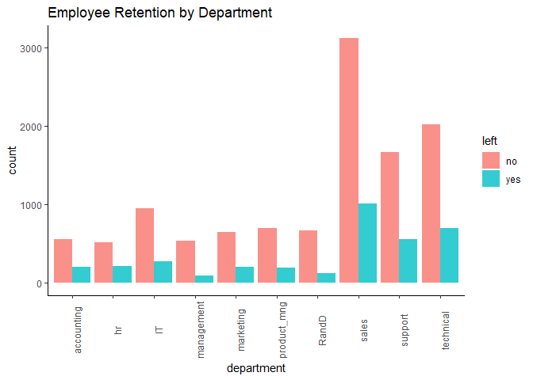

HR Data Analytics Markdown
================
Mwangi George
2022-10-05

-   <a href="#introduction" id="toc-introduction">Introduction</a>
-   <a href="#loading-necessary-packages"
    id="toc-loading-necessary-packages">Loading necessary packages.</a>
-   <a href="#loading-dataset-from-working-directory"
    id="toc-loading-dataset-from-working-directory">Loading dataset from
    working directory</a>
-   <a href="#understanding-the-dataframe"
    id="toc-understanding-the-dataframe">Understanding the dataframe.</a>
    -   <a href="#data-manipulation" id="toc-data-manipulation">Data
        manipulation</a>
-   <a href="#exploratory-data-analysis"
    id="toc-exploratory-data-analysis">Exploratory data analysis</a>
    -   <a href="#findings" id="toc-findings">Findings</a>

## Introduction

As noted in the README file, my main focus in this markdown is to
conduct Exploratory Data Analysis (EDA) and build a model that predicts
employee retention.

## Loading necessary packages.

For consistency of functions and productivity, I prefer working with the
whole `tidyverse package`.

``` r
# loading the package tidyverse. 
library(tidyverse) 
```

    ## ── Attaching packages ─────────────────────────────────────── tidyverse 1.3.2 ──
    ## ✔ ggplot2 3.3.6      ✔ purrr   0.3.4 
    ## ✔ tibble  3.1.8      ✔ dplyr   1.0.10
    ## ✔ tidyr   1.2.0      ✔ stringr 1.4.1 
    ## ✔ readr   2.1.2      ✔ forcats 0.5.2 
    ## ── Conflicts ────────────────────────────────────────── tidyverse_conflicts() ──
    ## ✖ dplyr::filter() masks stats::filter()
    ## ✖ dplyr::lag()    masks stats::lag()

``` r
# the argument quietly = T turns off verbose messages when loading the package.

# loading the package zoo for efficient dummy variable creation.
library(zoo)
```

    ## 
    ## Attaching package: 'zoo'
    ## 
    ## The following objects are masked from 'package:base':
    ## 
    ##     as.Date, as.Date.numeric

## Loading dataset from working directory

The dataset is in the comma separated values format.

``` r
# Read data from working directory and stores it as hr_data in R
hr_data <- read_csv("Dataset/HR_comma_sep.csv", 
                    show_col_types = F) 
```

## Understanding the dataframe.

Before jumping into the actual tasks, it is important that I understand
the data I am working with

``` r
# Print the structure of the dataframe
glimpse(hr_data)
```

    ## Rows: 14,999
    ## Columns: 10
    ## $ satisfaction_level    <dbl> 0.38, 0.80, 0.11, 0.72, 0.37, 0.41, 0.10, 0.92, …
    ## $ last_evaluation       <dbl> 0.53, 0.86, 0.88, 0.87, 0.52, 0.50, 0.77, 0.85, …
    ## $ number_project        <dbl> 2, 5, 7, 5, 2, 2, 6, 5, 5, 2, 2, 6, 4, 2, 2, 2, …
    ## $ average_montly_hours  <dbl> 157, 262, 272, 223, 159, 153, 247, 259, 224, 142…
    ## $ time_spend_company    <dbl> 3, 6, 4, 5, 3, 3, 4, 5, 5, 3, 3, 4, 5, 3, 3, 3, …
    ## $ Work_accident         <dbl> 0, 0, 0, 0, 0, 0, 0, 0, 0, 0, 0, 0, 0, 0, 0, 0, …
    ## $ left                  <dbl> 1, 1, 1, 1, 1, 1, 1, 1, 1, 1, 1, 1, 1, 1, 1, 1, …
    ## $ promotion_last_5years <dbl> 0, 0, 0, 0, 0, 0, 0, 0, 0, 0, 0, 0, 0, 0, 0, 0, …
    ## $ Department            <chr> "sales", "sales", "sales", "sales", "sales", "sa…
    ## $ salary                <chr> "low", "medium", "medium", "low", "low", "low", …

### Data manipulation

1.  From the above output, some variables that should be categorical
    variables are stored as doubles (numerics). This calls for some
    cleaning to avoid misleading results.

``` r
# convert the variables work_accident, left, promotion_last_5years, Department, and salary into factors.
hr_data <- hr_data %>% 
  mutate(Work_accident = as.factor(Work_accident)) %>% 
  mutate(left = as.factor(left)) %>% 
  mutate(promotion_last_5years = as.factor(promotion_last_5years)) %>% 
  mutate(Department = as.factor(Department)) %>% 
  mutate(salary = as.factor(salary))

# print new variables and their class
sapply(hr_data, class)
```

    ##    satisfaction_level       last_evaluation        number_project 
    ##             "numeric"             "numeric"             "numeric" 
    ##  average_montly_hours    time_spend_company         Work_accident 
    ##             "numeric"             "numeric"              "factor" 
    ##                  left promotion_last_5years            Department 
    ##              "factor"              "factor"              "factor" 
    ##                salary 
    ##              "factor"

2.  It is also clear from the `glimpse(hr_data)` output that there is an
    inconsistent naming of variables; Work_accident and Department start
    with upper case while others do not. To enhance productivity in
    later stages, I will convert them to lower case.

``` r
# print variable names 
names(hr_data)
```

    ##  [1] "satisfaction_level"    "last_evaluation"       "number_project"       
    ##  [4] "average_montly_hours"  "time_spend_company"    "Work_accident"        
    ##  [7] "left"                  "promotion_last_5years" "Department"           
    ## [10] "salary"

``` r
# rename all variables to lower case
hr_data <- hr_data %>% 
  rename_all(tolower)
```

3.  It is important to check for any missing data in the dataframe to
    avoid inconsistent results.

``` r
# check for rows with NAs 
hr_data[!complete.cases(hr_data),]
```

    ## # A tibble: 0 × 10
    ## # … with 10 variables: satisfaction_level <dbl>, last_evaluation <dbl>,
    ## #   number_project <dbl>, average_montly_hours <dbl>, time_spend_company <dbl>,
    ## #   work_accident <fct>, left <fct>, promotion_last_5years <fct>,
    ## #   department <fct>, salary <fct>

``` r
# No missing data
```

4.  Before moving to analysis, the `left` variable is a factor
    containing two levels, 0 if the employee continue to stay at the
    company and 1 if they left. For easier workflow, I will change these
    levels into `no` and `yes`.

``` r
hr_data <- hr_data %>% 
  mutate(left = if_else(left == 0, "no", "yes")) %>% 
  mutate(left = as.factor(left))

# read the first 3 rows of the dataframe
hr_data %>% 
  head(3)
```

    ## # A tibble: 3 × 10
    ##   satisfa…¹ last_…² numbe…³ avera…⁴ time_…⁵ work_…⁶ left  promo…⁷ depar…⁸ salary
    ##       <dbl>   <dbl>   <dbl>   <dbl>   <dbl> <fct>   <fct> <fct>   <fct>   <fct> 
    ## 1      0.38    0.53       2     157       3 0       yes   0       sales   low   
    ## 2      0.8     0.86       5     262       6 0       yes   0       sales   medium
    ## 3      0.11    0.88       7     272       4 0       yes   0       sales   medium
    ## # … with abbreviated variable names ¹​satisfaction_level, ²​last_evaluation,
    ## #   ³​number_project, ⁴​average_montly_hours, ⁵​time_spend_company,
    ## #   ⁶​work_accident, ⁷​promotion_last_5years, ⁸​department

``` r
# unique observations in the left variable
unique(hr_data$left)
```

    ## [1] yes no 
    ## Levels: no yes

## Exploratory data analysis

In this section, the objective is to find out which variables have a
direct and clear impact on employee retention. To accomplish this, I
will group the employees into two; those who left `yes` and those who
stayed `no`. For the numeric variables, I will calculate the mean for
each of the groups. These means are useful can be useful metrics to
explain employee retention.

``` r
# summarize the left employees based on mean (EDA)
hr_data %>% 
  group_by(left) %>% 
  summarise(mean_satisfaction_level = mean(satisfaction_level),
            mean_last_evaluation = mean(last_evaluation),
            mean_number_project = mean(number_project),
            mean_average_monthly_hours = mean(average_montly_hours),
            mean_time_spend_company = mean(time_spend_company))
```

    ## # A tibble: 2 × 6
    ##   left  mean_satisfaction_level mean_last_evaluation mean_numb…¹ mean_…² mean_…³
    ##   <fct>                   <dbl>                <dbl>       <dbl>   <dbl>   <dbl>
    ## 1 no                      0.667                0.715        3.79    199.    3.38
    ## 2 yes                     0.440                0.718        3.86    207.    3.88
    ## # … with abbreviated variable names ¹​mean_number_project,
    ## #   ²​mean_average_monthly_hours, ³​mean_time_spend_company

### Findings

-   **Part 1 - Numeric Variables**

1.  There exists a big difference in the `mean_satisfaction_level`
    between employees who left and those who stayed. Employees who left
    had a lower satisfaction level compared to those who stayed by
    0.2267116 `(0.6668096-0.4400980)`. This could explain why they left
    but further statistical analysis is necessary to test whether the
    difference observed is statistically significant.
2.  There is no clear impact of the variable `last_evaluation` on
    employee retention since the means for both groups are nearly equal.
    Mean difference of
3.  The same case applies to `mean_number_project`. The difference is
    very small but statistical analysis is vital to test if it is indeed
    statistically significant.
4.  The difference in the `mean_average_monthly_hours` between employees
    who left and those who stayed is quite big. On average, those who
    left appear to have been working more more than those who stayed by
    8.359 hours.
5.  For the categorical variables i.e (`work_accident`, `department`,
    and `salary`), I will have to take another approach to understand
    their impact on employee retention.

-   **Part 2 - Categorical Variables**

1.  **Impact of employee salary on retention** Since I am dealing with
    two categorical variables, the best way to understand their
    relationship is through a visualization. First, I will create a
    table that summarizes the salary categories by whether one left or
    stayed.

``` r
# count the number of employees in each salary category and group by the left variable
hr_data %>% 
  select(left, salary) %>% 
  group_by(left) %>% 
  table()
```

    ##      salary
    ## left  high  low medium
    ##   no  1155 5144   5129
    ##   yes   82 2172   1317

``` r
# bar chart showing impact of employees salaries on retention
ggplot(data = hr_data)+
  geom_bar(aes(x = salary, fill = left), position = "dodge")+
  labs(title = "Employee Retention by Salary Category", y = "Count")+
  theme_classic()
```

<!-- -->

From the above graph, most of the employees who left the company were in
the low salary category, followed by medium then high. I notice that
these results are consistent with theory.

2.  **Correlation between Employee Department and Retention**

``` r
# count the number of employees in each department category and group by the left variable
hr_data %>% 
  select(department, left) %>% 
  group_by(left) %>% 
  table()
```

    ##              left
    ## department      no  yes
    ##   accounting   563  204
    ##   hr           524  215
    ##   IT           954  273
    ##   management   539   91
    ##   marketing    655  203
    ##   product_mng  704  198
    ##   RandD        666  121
    ##   sales       3126 1014
    ##   support     1674  555
    ##   technical   2023  697

``` r
# Achieving the same using base R xtabs function
xtabs(~department+ left, hr_data)
```

    ##              left
    ## department      no  yes
    ##   accounting   563  204
    ##   hr           524  215
    ##   IT           954  273
    ##   management   539   91
    ##   marketing    655  203
    ##   product_mng  704  198
    ##   RandD        666  121
    ##   sales       3126 1014
    ##   support     1674  555
    ##   technical   2023  697

``` r
## bar chart showing correlation between Employee Department and Retention
hr_data %>% 
  ggplot(aes(department, fill = left))+
  geom_bar(position = "dodge", alpha = 0.8)+
  theme_classic()+
  theme(axis.text.x = element_text(angle = 90))+
  labs(title = "Employee Retention by Department")
```

<!-- -->

From the above chart, most of the employees who left the firm were in
the sales department, followed by the technical department and then
support department as the top 3. Based on this exploratory analysis, it
is safe to say that the variables `satisafaction_level`,
`number_project`, `average_monthly_hours`, `department`, and `salary`
have a high impact on employee retention. Using these variables, I will
proceed to building a logistic regression model to predict employee
retention.
